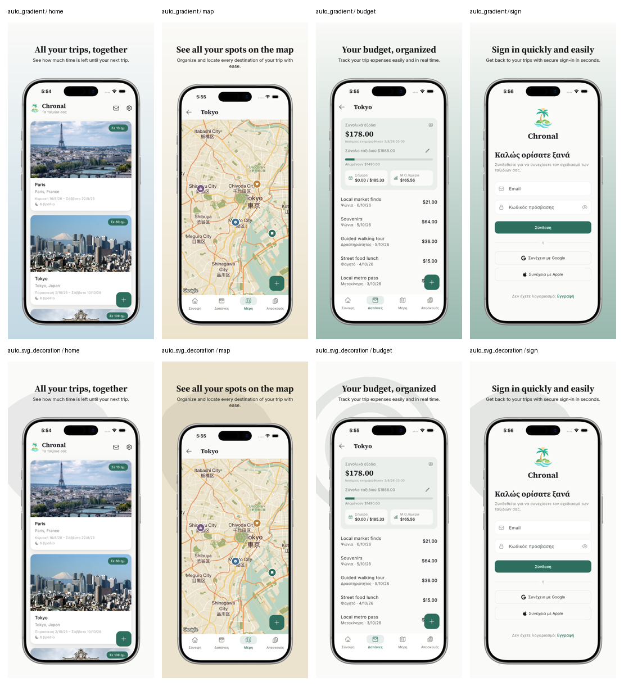

# app-store-suite

Store-asset and shipping automation for Flutter apps: unattended screenshot capture
via deep links, framed/titled store-ready marketing images, the Play Store icon and
feature graphic, Google Play / App Store listing copy via the `claude` CLI, and
shipping builds to TestFlight / Play Store internal testing via fastlane. A local web
control panel ties it together: run auto-capture, browse composed screenshots per
language, edit/regenerate listing copy, and ship — all from one page.

Installs as a single global `appstoresuite` command (via pipx) so it runs from any
directory. It holds no per-app state itself — each app's config lives in that app's
own repo (see `example/app_store_suite.example.yaml`), the same way `pubspec.yaml`
or `l10n.yaml` do.

## Install

```bash
cd app-store-suite
pipx install --editable .
```

`--editable` means pulling future changes in this repo (`git pull`) takes effect
immediately, without reinstalling. Upgrading after a `git pull`:

```bash
pipx upgrade app-store-suite
```

## Set up a new app

Copy `example/app_store_suite.example.yaml` into your Flutter app's own repo root
(e.g. as `app_store_suite.yaml`, alongside `pubspec.yaml`), and fill in `app.name`,
`icon_source`, your devices, and (if you want `auto-capture`) `deep_link_scheme` +
`shots:` — see "Auto-capture requirements" below. `flutter_dir: .` assumes the config
sits at the repo root; adjust if not. Add `.appstoresuite/` to that app's own
`.gitignore` — it's where all generated output (raw + composed screenshots, listing
copy, style choices) is written, next to the config.

If a device identifier isn't already in `app_store_suite/devices.py`'s `FRAME_MAP`,
either add a frame mapping there or accept the procedural rounded-corner fallback
frame `compose.py` uses instead.

## Usage

Every command takes `--config` pointing at wherever you put that app's config.

```bash
# One-time: create any missing Android AVDs, cache device bezel frames.
appstoresuite setup --config /path/to/your-app/app_store_suite.yaml

# Unattended capture: boots each configured device, opens each configured shot's
# deep link, screenshots it, tears the device down again. See "Auto-capture
# requirements" below for what the app itself needs to expose.
appstoresuite auto-capture --config /path/to/your-app/app_store_suite.yaml
appstoresuite auto-capture --config /path/to/your-app/app_store_suite.yaml --device ios_phone
appstoresuite auto-capture --config /path/to/your-app/app_store_suite.yaml --render-delay 3

# Composites .appstoresuite/raw/<device>/<shot>.png into
# .appstoresuite/<lang>/store/<device>/<shot>.png: device bezel frame (or the
# procedural fallback), background, and the shot's title.
appstoresuite compose --config /path/to/your-app/app_store_suite.yaml

# 512x512 Play Store app icon, resized from app.icon_source.
appstoresuite store-icon --config /path/to/your-app/app_store_suite.yaml

# 1024x500 Play Store feature graphic.
appstoresuite feature-graphic --config /path/to/your-app/app_store_suite.yaml --headline "Plan every trip"

# Drafts "proposed" Google Play / App Store listing copy (app name, descriptions,
# keywords) from the shots' titles/subtitles via the `claude` CLI, written into
# .appstoresuite/<lang>/store_listing.json alongside "current" (see below).
# Character counts against each store's limits are computed in Python, not
# trusted from the model's own output.
appstoresuite store-listing --config /path/to/your-app/app_store_suite.yaml

# Fetches the currently-live listing copy from App Store Connect (fastlane deliver)
# and/or Play Console (fastlane supply) into "current" in the same JSON file,
# leaving "proposed" untouched. Requires store credentials in the config (below).
appstoresuite fetch-listing --config /path/to/your-app/app_store_suite.yaml

# Translate one language's shot titles/subtitles into another via the `claude` CLI
# (separate from the app's own ARB strings — see "Auto-capture requirements" above).
appstoresuite translate-titles --config /path/to/your-app/app_store_suite.yaml --from en --to el

# Local web control panel: run auto-capture, browse the composed screenshot gallery
# per language, regenerate with a random style, edit/regenerate listing copy, and
# ship — see "Web control panel" below.
appstoresuite ui --config /path/to/your-app/app_store_suite.yaml
```

## Auto-capture requirements

Unattended capture drives the app itself via deep link — no manual navigation, no
interactive prompts. For the target app to support it, it needs to expose three
things:

1. **A deep-link scheme.** Declare it in the config:

   ```yaml
   app:
     deep_link_scheme: chronal # chronal://<route>
   ```

   The app must register that scheme (iOS: `CFBundleURLSchemes` in `Info.plist`;
   Android: an `<intent-filter>` with `android:scheme="chronal"` on the launcher
   activity) and be able to handle it while cold-starting or already running.

2. **A fixed shot list with stable keys**, one entry per screen you want captured,
   in the config:

   ```yaml
   shots:
     - id: home
       route: shot/home
     - id: trip_map
       route: shot/trip-map
   ```

   `id` is the filename shots are saved/composed under (must stay stable across
   runs — renaming it starts that shot over with a fresh AI-suggested title).
   `route` is whatever your app's router expects after the `scheme://`.

3. **A debug router that lands on each route with sample data already loaded** —
   no login, no live network calls, no dependency on real user state. A route
   handler should short-circuit straight to the target screen with mock/sample
   data injected (chronal does this for trip previews already — reuse that
   pattern: a `shot/<screen>` route maps to the same screen a normal navigation
   would reach, but seeded with a canned sample trip instead of requiring the
   user to have actually created one). Keep this behind a debug-only build flag
   if the scheme shouldn't be reachable in production.

ARB/localization strings aren't part of this contract — auto-capture runs the app in
whatever locale the device/simulator is already set to. Composed titles/subtitles are
generated separately per shot by `store-listing`/`translate-titles`, stored in
`.appstoresuite/<lang>/titles.json`, independent of the app's own ARB files.

Without `deep_link_scheme` + `shots:` configured, `auto-capture` refuses to run
(fails fast with what's missing) — every other command still works.

## Listing metadata: current vs. proposed

`.appstoresuite/<lang>/store_listing.json` holds one entry per field (app name,
descriptions, keywords, etc.), each with a `current` value (what's actually live,
pulled by `fetch-listing`) and a `proposed` value (a draft, from `store-listing` or
hand-edited). Nothing is ever uploaded automatically — copy `proposed` into App Store
Connect / Play Console's own listing forms yourself once you're happy with it.

`fetch-listing` needs store credentials in the config — reuse whatever your Fastfile
already uses for shipping:

```yaml
app:
  bundle_id: com.yourcompany.yourapp
  asc_key_id: XXXXXXXXXX
  asc_issuer_id: xxxxxxxx-xxxx-xxxx-xxxx-xxxxxxxxxxxx
  asc_key_path: keys/AuthKey_XXXXXXXXXX.p8 # relative to flutter_dir
  android_package_name: com.yourcompany.yourapp
  play_json_key: keys/your-service-account.json # relative to flutter_dir
```

Store locale codes don't always match your own language codes (e.g. Play uses
`el-GR` for Greek where App Store Connect just uses `el`) — `fetch-listing` tries
your code as-is first, then a couple of common variants for `en`. If it can't find a
match it fails with the locale codes it actually found, so you can add an override:

```yaml
store_locales:
  el: el-GR
```

`fetch-listing` runs `fastlane deliver`/`fastlane supply` in a scratch
`fastlane/metadata/` directory inside the app's repo (their standard working
format — dozens of per-field `.txt` files); app-store-suite reads what it needs
from there into the JSON and deletes that scratch directory again immediately,
so it doesn't linger as clutter.

## Web control panel

```bash
appstoresuite ui --config /path/to/your-app/app_store_suite.yaml
```

Opens a local page (default `http://127.0.0.1:5175`) with four tabs:

- **Auto-Capture** — run it across all devices or just one; shows which shots are
  captured per device.
- **Store Preview** — browse composed screenshots per language; per-shot style
  picker plus "apply one style to all shots".
- **Metadata** — a table of current (read-only, from the stores) vs. proposed
  (editable) per field; buttons to fetch current, draft proposed via Claude, or
  save your edits.
- **Ship** — buttons for `ship-ios` / `ship-android`, confirmed before running since
  they upload a real build.

## Shipping

These operate directly on a Flutter project checkout (`--project-dir`), no config
needed.

```bash
# Bumps pubspec.yaml's PATCH and +BUILD together, e.g. 1.0.6+9 -> 1.0.7+10.
# Run once per release, before ship-ios / ship-android, so both platforms ship the
# same version.
appstoresuite bump-version --project-dir /path/to/your-app

# Builds the ipa and uploads it to TestFlight, via `bundle exec fastlane ios <lane>`.
# Requires a Fastfile with that lane (default: ship_testflight) already set up.
appstoresuite ship-ios --project-dir /path/to/your-app
appstoresuite ship-ios --project-dir /path/to/your-app --lane ship_testflight

# Builds the App Bundle and uploads it to Play Store internal testing, via
# `bundle exec fastlane android <lane>` (default lane: ship_internal).
appstoresuite ship-android --project-dir /path/to/your-app

# Translates missing Flutter ARB strings via arb_translate, then regenerates the
# localization classes (`flutter pub get` + `flutter gen-l10n`). Requires
# ARB_TRANSLATE_API_KEY in the environment or a .env file in --project-dir.
# arb_translate itself is vendored at vendor/arb_translate (a fork of
# https://github.com/leancodepl/arb_translate) and gets activated automatically
# the first time it's needed — pass --activate-source to use a different fork.
appstoresuite translate-arb --project-dir /path/to/your-app
```

## Style options

`style:` in a config controls one consistent look for the whole app (not per-shot).
All fields are optional; omitting them keeps the original solid-background, upright,
undecorated look.



```yaml
style:
  background_color: "#FAFAF8"
  background_mode: "solid" # solid | auto | gradient
  gradient_color2: "#D8E6FF" # 2nd color for background_mode: gradient (top -> bottom).
  # Omit it and it's auto-derived per shot instead: a vivid accent color sampled from
  # that screenshot's own content (skipping white/gray UI chrome), pastel-lightened.
  title_color: "#1A1A1A"
  font_bold: "Poppins-Bold.ttf"
  font_regular: "Poppins-Regular.ttf"
  layout: "centered" # centered | tilted
  tilt_degrees: 6 # rotation for layout: tilted; alternates left/right per shot
  decoration: "none" # none | shapes | svg
  decoration_color: "#1A1A1A" # for decoration: shapes | svg. Omit it and it's
  # auto-derived the same way as gradient_color2 (falls back to title_color if the
  # screenshot has nothing vivid enough to sample).
  decoration_svg_dir: decorations # for decoration: svg — dir of .svg files, one picked
  # per shot deterministically, rasterized via CairoSVG and drawn behind the device at
  # low opacity. Path is relative to the config file's own directory.
```

Text color is also always auto-checked for contrast against whatever it actually sits
on (background + decoration) — `title_color` is kept if it already contrasts, otherwise
swapped for white-on-dark or near-black-on-light automatically.

`background_mode: auto` and `background_mode: gradient` are mutually exclusive —
`gradient` always uses `background_color`/`gradient_color2` and ignores per-shot
sampling. Tilt direction and svg/shape choice are both derived from a hash of the shot
id, so the same shot always renders the same way across devices and re-runs.

Use `style-preview`/`style-pick` to compare variants and pin one per shot:

```bash
appstoresuite style-preview --config /path/to/your-app/app_store_suite.yaml
appstoresuite style-pick --config /path/to/your-app/app_store_suite.yaml --shot home --variant gradient
appstoresuite style-pick --config /path/to/your-app/app_store_suite.yaml --list
```

## How device frames work

Bezel images and screen-offset metadata come from
[fastlane/frameit-frames](https://github.com/fastlane/frameit-frames) (MIT), fetched
on demand and cached at `~/.cache/app-store-suite/frames`. The mapping from a
simulator/AVD name to a frame asset lives in `app_store_suite/devices.py`
(`FRAME_MAP`) — frameit's device coverage skews toward real iOS/Android hardware
names, so `resolve_frame()` looks up by exact identifier; add an entry there for any
new device. If nothing matches (e.g. no modern Android tablet frame exists upstream),
`compose.py` falls back to a clean procedural rounded-corner + shadow frame instead
of failing.

## Note on run mode

`auto-capture` always launches the app with plain `flutter run` (debug mode) — the
iOS Simulator can't run release/profile builds, only physical devices can. Make sure
your app sets `debugShowCheckedModeBanner: false` on `MaterialApp` so the red DEBUG
ribbon doesn't show up in screenshots.
